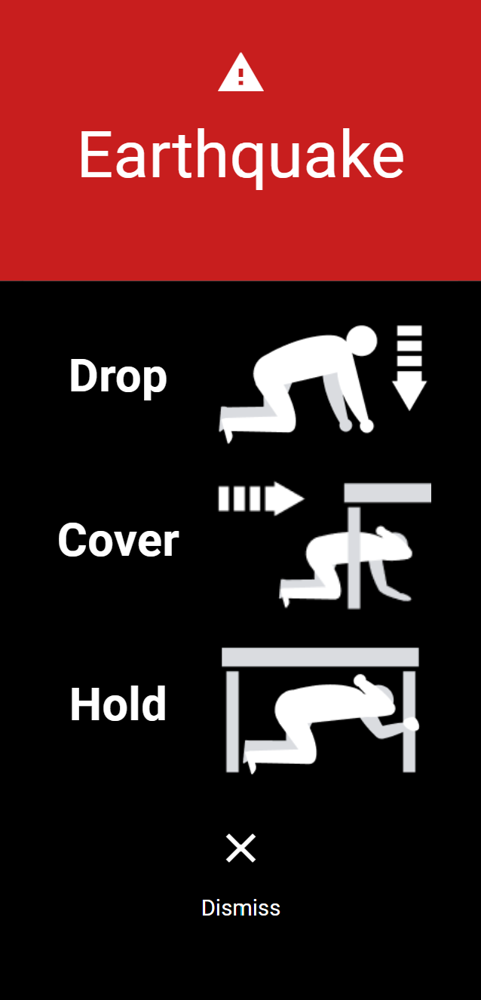
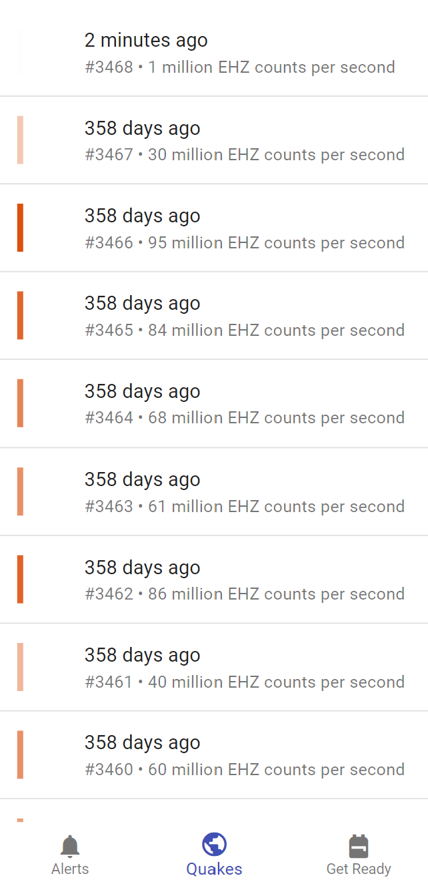
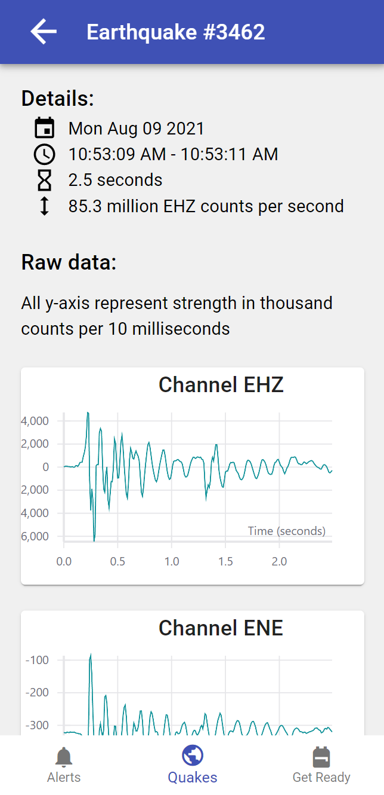
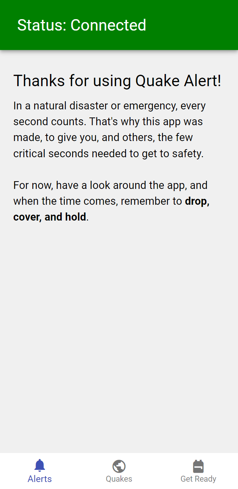
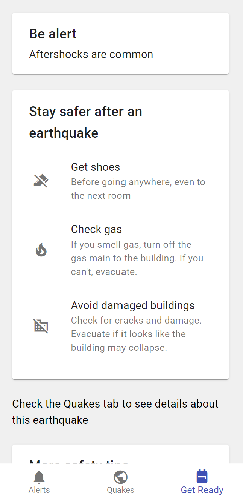

# CRISiSLab Competition 2021 - Alert Frontend

This is the alert frontend of my submission to 2021 CRISiSLab Competition which
I won.

This views earthquake history and recieves earthquake alerts in conjunction with
the backend using Socket.io.

Here's the [backend](https://github.com/ben476/crisislab-competition-backend)

## Screenshots

This project was bootstrapped with
[Create React App](https://github.com/facebook/create-react-app).

## Available Scripts

In the project directory, you can run:

### `npm start`

Runs the app in the development mode.\
Open [http://localhost:3000](http://localhost:3000) to view it in the browser.

The page will reload if you make edits.\
You will also see any lint errors in the console.

### `npm test`

Launches the test runner in the interactive watch mode.\
See the section about
[running tests](https://facebook.github.io/create-react-app/docs/running-tests)
for more information.

### `npm run build`

Builds the app for production to the `build` folder.\
It correctly bundles React in production mode and optimizes the build for the
best performance.

The build is minified and the filenames include the hashes.\
Your app is ready to be deployed!

See the section about
[deployment](https://facebook.github.io/create-react-app/docs/deployment) for
more information.

## Screenshots

 
 
 
