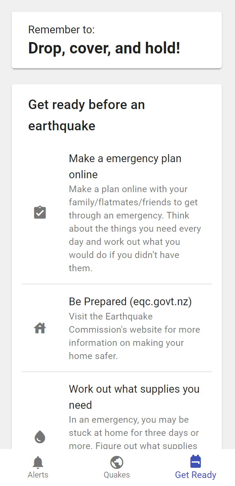

# CRISiSLab Competition 2021 - Alert Frontend

This is the alert frontend of my submission to 2021 CRISiSLab Competition which
I won.

This views earthquake history and recieves earthquake alerts in conjunction with
the backend using Socket.io.

Here's the [backend](https://github.com/ben476/crisislab-competition-backend)

## Screenshots

 
 
 
